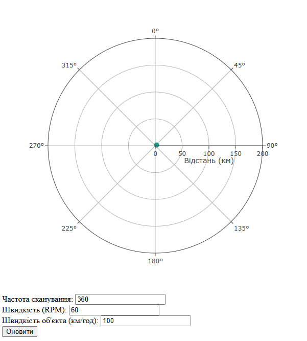

# Звіт з лабораторної роботи №4
## Розробка додатку для візуалізації вимірювань радару

### Опис роботи
В ході виконання лабораторної роботи було розроблено веб-додаток для візуалізації даних радару. Програма отримує дані через WebSocket з'єднання та відображає їх у полярній системі координат.

Основні компоненти розробленого додатку:
- Візуалізація даних у вигляді полярного графіка
- Елементи керування для налаштування параметрів радару:
  - Частота сканування (вимірювань за оберт)
  - Швидкість обертання антени (RPM)
  - Швидкість об'єкта (км/год)
- Обробка даних у реальному часі

На зображенні представлено інтерфейс програми з налаштуваннями:
- Частота сканування: 360 вимірювань за оберт
- Швидкість обертання: 60 RPM
- Швидкість об'єкта: 100 км/год

### Висновок
Розроблений додаток успішно виконує функції візуалізації даних радару в реальному часі та дозволяє налаштовувати параметри системи. Реалізоване рішення може бути використане для моніторингу та аналізу радарних даних у навчальних цілях.
